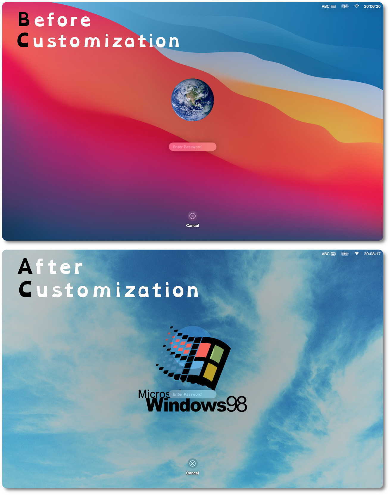

To Customize The Login Screen of MacOS Big Sur
================================================

MacOS's Signed System Volume makes it hard to customize the login screen.

- https://discussions.apple.com/thread/253382773?answerId=256530762022#256530762022
- https://support.apple.com/guide/security/signed-system-volume-security-secd698747c9
- https://grafxflow.co.uk/blog/mac-os-x/delete-ioplatformpluginfamilykext-macos-big-sur
- https://github.com/calasanmarko/TurboMac

How to Use This Application
-----------------------------

1. Download [this zipball](https://github.com/jakwings/macos-desktop/archive/refs/heads/master.zip) and unpack it.

2. Click open `SetDesktopPicture`, or run this command in your terminal: `SetDesktopPicture [<desktop picture> [<user picture>]]`.

Screenshots: Before & After
-----------------------------

Known Problems
----------------

* Only the picture of the current desktop is set. (: by design :)

* The start-up login screen cannot be customized yet.

* Must enable `System Preferences > Users & Groups > Login Options > Display login window as: List of users` in order to customize the lock screen.

* The screenshot above looks unreal. (; yes, the username has been photoshopped away ;)
